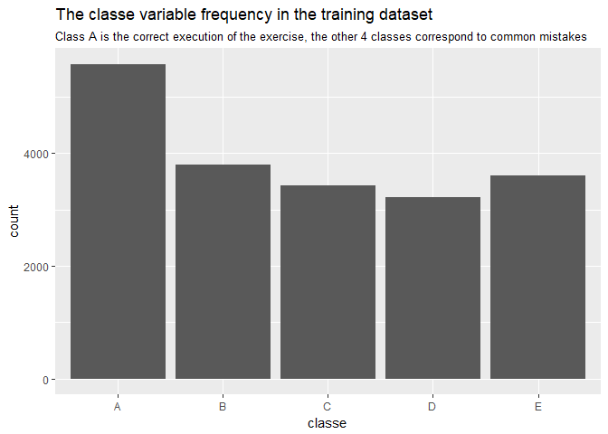
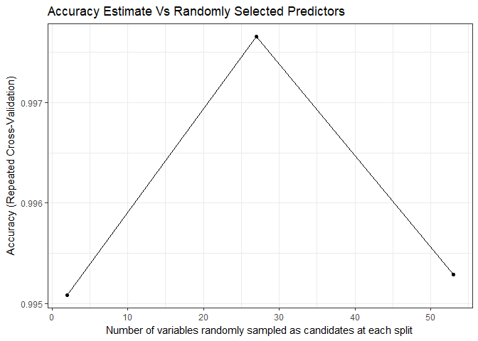
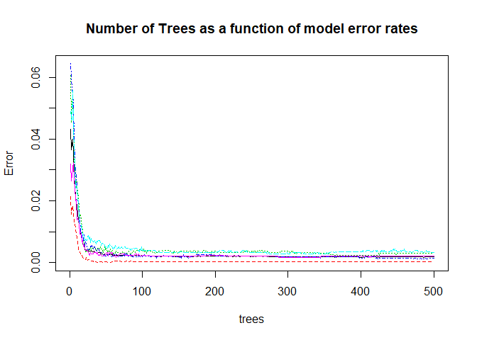
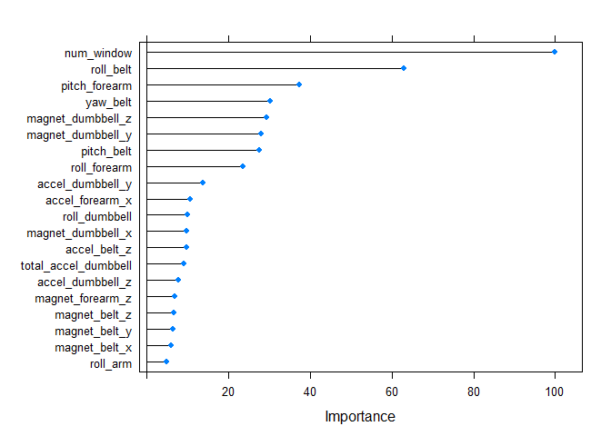

## Executive summary
Using devices such as Jawbone Up, Nike FuelBand, and Fitbit it is now possible to collect a large amount of data about personal activity relatively inexpensively. These type of devices are part of the quantified self movement. One thing that people regularly do is quantify how much of a particular activity they do, but they rarely quantify how well they do it.
In this Course project Report I will demonstrate the use of **random forest** machine learning algorithm to predict if barbell lifts are done correctly, by useing data from accelerometers on the belt, forearm, arm, and dumbell of 6 participants. They were asked to perform barbell lifts correctly and incorrectly in 5 different ways: exactly according to the specification (Class A), throwing the elbows to the front (Class B), lifting the dumbbell only halfway (Class C), lowering the dumbbell only halfway (Class D) and throwing the hips to the front (Class E).
More information is available from the website [here](http://groupware.les.inf.puc-rio.br/har) (see the section on the Weight Lifting Exercise Dataset). 
the goal of the Project is to to predict the "classe" variable from a training dataset on a testing dataset.
This demonstrate is the "Course Project" from Practical Machine Learning Course by Johns Hopkins University on coursera.

## Library setup & setting seed for reproducibility

```r
Pack <- c("knitr", "readr", "dplyr", "ggplot2","randomForest","caret","parallel","doParallel")
lapply(Pack, library, character.only = TRUE)
set.seed(79134)
```

## Model picking strategy
After reading Leonard Greski [post](https://github.com/lgreski/datasciencectacontent/blob/master/markdown/pml-requiredModelAccuracy.md) on Required Model Accuracy for the Course project I was planning to try a bunch of models, Tuning parameters and feature manipulation until I will get satisfying accuracy but luckily, after a little data cleaning, my first model pick did the trick.
I started with random forest for the following reasons:

* on the [Qualitative Activity Recognition of Weight Lifting Exercises](http://groupware.les.inf.puc-rio.br/work.jsf?p1=11201) article they stated thet Because of the  characteristic noise in the sensor data, they used a Random Forest approach.
* easy to implement in caret (only one Tuning parameter).
* generally have a good prediction performance
* it is a robust model that does not need a lot of data PreProcessing and can hendle some messy data

you can read more on the Random forest algorithm [here](https://en.wikipedia.org/wiki/Random_forest)

## Project Data 
The training data are available [here](https://d396qusza40orc.cloudfront.net/predmachlearn/pml-training.csv),
The test data are available [here](https://d396qusza40orc.cloudfront.net/predmachlearn/pml-testing.csv)

* Read the Data

```r
pml_training <- read_csv("pml-training.csv")
pml_testing <- read_csv("pml-testing.csv")
pml_training$classe <- as.factor(pml_training$classe) #convert "classe" variable to a factor
```
the training data has 19622 observations and 160 variables.
The goal of the model is to predict the "classe" variable from the training data on the testing data.

```r
ggplot(data = pml_training,aes(x = pml_training$classe)) + geom_bar() + ggtitle("The classe variable frequency in the training dataset","Class A is the correct execution of the exercise, the other 4 classes correspond to common mistakes") + xlab("classe")
```

<!-- -->


### Data cleaning
**Filtering rows of aggregated data that are unavailable on the real test data**

```r
pml_training <- filter(pml_training, new_window == "no") 
```
**removing some obvious non Predictive variables Like:**

* the row id
* the name of the participants
* the Time record of the exercise

```r
pml_training <- select(pml_training,-(X1:new_window))
pml_testing <- select(pml_testing,-(X1:new_window))
```
**removing variables with over 50% missing values**

```r
training_ncols <- ncol(pml_training)
most_NA <- vector(mode = "logical",length = training_ncols)
for(i in 1:training_ncols){
    if((sum(is.na(pml_training[,i]))/nrow(pml_training)) > 0.5){ most_NA[i] <- TRUE}
}
pml_training <- pml_training[,!most_NA] 
```
we're left with 53 variables + the classe variable

checking for remaining missing values

```r
na_left <- sapply(pml_training, function(x) sum(is.na(x)))
na_left[na_left > 0]
```

```
## magnet_dumbbell_z  magnet_forearm_y  magnet_forearm_z 
##                 1                 1                 1
```

**imputing missing data and removing Zero-Variance Predictors**
this step is not necessarily necessary for random forest algorithm but removing predictors can reduce the computing power needed and is good practice

```r
classe_col <- ncol(pml_training)
preProcessTraining <- preProcess(pml_training[,-classe_col], method = c("knnImpute","nzv"))
pml_training[,-classe_col] <- predict(preProcessTraining, pml_training[,-classe_col])
pml_testing <-  predict(preProcessTraining,pml_testing) # using the Training preProcess on the test data
```
note: the preProcess did not use the "classe" variable so it is ok to do this on all the training data set (including the validation set)


**Partition the training data to training & validation setes**

```r
inTrain = createDataPartition(pml_training$classe, p = 0.8,list = FALSE)
training <- pml_training[ inTrain,]
validation <- pml_training[-inTrain,]
```
the validation set will help to estimate the *out of sample error*


**Allow parallel processing**
thanks to Leonard Greski [post](https://github.com/lgreski/datasciencectacontent/blob/master/markdown/pml-randomForestPerformance.md) on *Improving Performance of Random Forest in caret::train()* I will use parallel processing

```r
cluster <- makeCluster(detectCores() - 1) # convention to leave 1 core for OS
registerDoParallel(cluster)
```

**fit the model**
I used 5 repeated 10 fold cross-validation for tuning the number of variables randomly sampled as candidates at each split for each tree in the "forest". 

```r
fitControl <- trainControl(method = "repeatedcv",number = 10,repeats = 5,allowParallel = TRUE) 
fit_rf <- train(classe ~ ., method="rf",data=training,trControl = fitControl)
```

**Stop parallel processing**

```r
stopCluster(cluster)
registerDoSEQ()
```

## Model performance & statistics
in order to estimate the **out of sample error** I will use the model to predict the *classe* on the validation dataset and then compute confusion matrix

```r
pred_rf <- predict(fit_rf,validation)
Accuracy_rf <- confusionMatrix(data = pred_rf, reference = validation$classe)$overall["Accuracy"]
confusionMatrix(data = pred_rf, reference = validation$classe)
```

```
## Confusion Matrix and Statistics
## 
##           Reference
## Prediction    A    B    C    D    E
##          A 1093    1    0    0    0
##          B    0  742    2    0    0
##          C    0    0  668    0    0
##          D    0    0    0  629    3
##          E    1    0    0    0  702
## 
## Overall Statistics
##                                           
##                Accuracy : 0.9982          
##                  95% CI : (0.9962, 0.9993)
##     No Information Rate : 0.2848          
##     P-Value [Acc > NIR] : < 2.2e-16       
##                                           
##                   Kappa : 0.9977          
##  Mcnemar's Test P-Value : NA              
## 
## Statistics by Class:
## 
##                      Class: A Class: B Class: C Class: D Class: E
## Sensitivity            0.9991   0.9987   0.9970   1.0000   0.9957
## Specificity            0.9996   0.9994   1.0000   0.9991   0.9997
## Pos Pred Value         0.9991   0.9973   1.0000   0.9953   0.9986
## Neg Pred Value         0.9996   0.9997   0.9994   1.0000   0.9990
## Prevalence             0.2848   0.1934   0.1744   0.1638   0.1835
## Detection Rate         0.2846   0.1932   0.1739   0.1638   0.1828
## Detection Prevalence   0.2848   0.1937   0.1739   0.1645   0.1830
## Balanced Accuracy      0.9994   0.9990   0.9985   0.9995   0.9977
```
the Accuracy of the model is: 0.9981776.
so the **out of sample error** estimate is: 1 - 0.9981776 = 0.0018224

**The number of predictors sampled for spliting at each node:** 27

```r
ggplot(fit_rf) + theme_bw() + xlab("Number of variables randomly sampled as candidates at each split") +
    ggtitle("Accuracy Estimate Vs Randomly Selected Predictors")
```

<!-- -->

**Number of trees grown:** 500

```r
    plot(fit_rf$finalModel, main="Number of Trees as a function of model error rates")
```

<!-- -->

It's look like the errors level off at a little over a 100 trees, so I can reduce the computing power necessary by reducing the number of trees by seeting the ntree component of the model.

while It's difficult to interpret Random Forests models, I can still get insights and ability for some critique by examining the relative importance of the predictors to the model:

```r
rf_Imp <- varImp(fit_rf, scale = TRUE)
plot(rf_Imp, top = 20)
```

<!-- -->

## Using the model To predict the classe of the Weight Lifting Exercise on the Test Data
This is the goal of the model (project)

```r
pred_rf_testing <- predict(fit_rf,pml_testing)
data.frame(pml_testing$problem_id,pred_rf_testing)
```

```
##    pml_testing.problem_id pred_rf_testing
## 1                       1               B
## 2                       2               A
## 3                       3               B
## 4                       4               A
## 5                       5               A
## 6                       6               E
## 7                       7               D
## 8                       8               B
## 9                       9               A
## 10                     10               A
## 11                     11               B
## 12                     12               C
## 13                     13               B
## 14                     14               A
## 15                     15               E
## 16                     16               E
## 17                     17               A
## 18                     18               B
## 19                     19               B
## 20                     20               B
```


